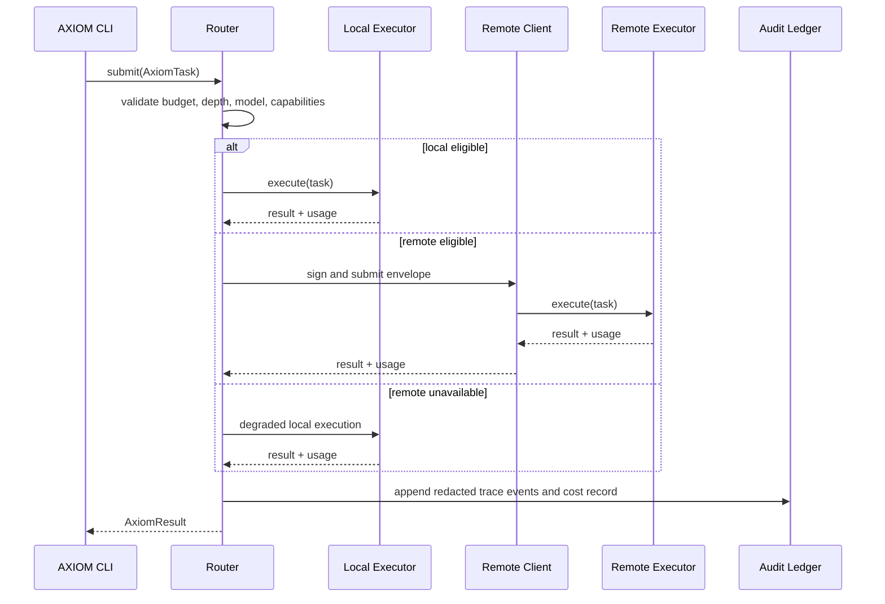

# AXIOM OS Reference Architecture

## Purpose

AXIOM OS is implemented here as a **runnable, container-native hybrid-agent reference platform**, rather than as a custom Linux kernel or distributable ISO. The implementation preserves the specification’s core operational properties: immutable configuration inputs, bounded-depth routing, persistent trace identifiers, replayable task envelopes, local-first degradation, and per-task cost attribution.

> A task is an immutable envelope with a `trace_id` that crosses every local, remote, persistence, and replay boundary.

The repository deliberately separates deterministic control-plane logic from infrastructure adapters. This allows the routing, auditing, cost, replay, and resilience behavior to be executed and tested on a development machine without a GPU, a Kubernetes cluster, or a model server. Kubernetes, OpenTelemetry, Ollama, and vLLM are supplied as optional production adapters and manifests.

| Layer | Reference implementation | Production adapter or deployment target |
|---|---|---|
| Task contract | Pydantic v2 models with canonical JSON | `AxiomJob` Kubernetes custom resource |
| Hybrid routing | Deterministic policy engine | Local Ollama and remote vLLM capabilities |
| Execution | Injectable local and remote executors | HTTP inference endpoints and Kubernetes Jobs |
| Observability | Structured in-memory and JSONL spans | OpenTelemetry Protocol collector and Jaeger |
| Cost attribution | Deterministic token, runtime, and egress ledger | Prometheus/Kubecost integration |
| State and replay | JSON task/result records and SHA-256 manifests | Redis, PostgreSQL, NFS/S3 audit storage |
| Security boundary | Signed envelopes and redacted trace attributes | mTLS, certificate pinning, KMS-backed storage |

## Delivery Scope

The repository delivers the AXIOM control plane and deployment scaffolding. Kernel compilation, an ISO image, GPU drivers, an EKS account, secrets, certificates, model weights, and third-party service licenses remain environment-specific operational inputs. Build scripts validate prerequisites and produce deterministic manifests and container artifacts; they do not claim to create a production kernel image in an unprivileged developer environment.

| Capability | Included | Verification path |
|---|---:|---|
| Bounded local-versus-remote decision | Yes | Unit tests and CLI simulation |
| Trace continuity across routing and replay | Yes | JSONL audit records and replay tests |
| Graceful local-only fallback | Yes | Circuit-breaker tests |
| Per-task local and remote cost reporting | Yes | CLI cost breakdown and tests |
| Kubernetes `AxiomJob` schema and controller | Yes | Helm/Kubernetes manifests and dry-run validation |
| Local container service topology | Yes | Docker Compose configuration |
| Remote model serving or managed EKS provisioning | Configuration only | Deployment documentation |
| Kernel, BTRFS, NFS, GPU and KMS provisioning | Configuration hooks only | Operator runbook |

## Execution Flow

## Routing Contract

The router is deterministic: given identical `AxiomTask`, capability snapshot, policy, and remote-health state, it selects the same execution location and records the exact reason. Routing first honors explicit user placement. In `auto` mode it routes locally only when the model is cached, the capability snapshot satisfies VRAM and GPU requirements, recursion is within the local depth limit, context does not exceed the local context limit, and the predicted local frame fits the configured budget. Otherwise it sends the signed envelope to the remote tier. If remote execution is unavailable, the router may degrade to local execution only when the task does not strictly require remote-only compute.

## Data and Privacy Contract

The audit ledger is append-only JSONL partitioned by trace identifier. It stores task and span identifiers, timings, routing reasons, execution location, resource totals, pricing inputs, hashes, and sanitized errors. It does **not** persist the raw objective or serialized state by default. Those sensitive fields are represented by SHA-256 digests in trace events; replay exports require an explicit task record and are intended to be stored in a protected artifact location.

## Reproducibility Contract

A replay export includes the canonical task JSON, task digest, trace identifier, policy snapshot, capability snapshot, and result digest. The verification command compares canonical digests rather than asserting that non-deterministic language-model text is bit-identical. For deterministic executors, output content is compared exactly; for non-deterministic backends, trace continuity, task identity, policy selection, and declared model configuration remain verifiable.

## Operational Profiles

| Profile | Intended use | Remote dependency | Typical command |
|---|---|---:|---|
| `local` | Fast development and offline testing | None | `axiom init --mode local` |
| `remote` | Cluster-only agent execution | Required | `axiom init --mode remote` |
| `hybrid` | Local-first routing with spillover | Optional at runtime | `axiom init --mode hybrid` |
| `simulation` | CI and no-infrastructure validation | None | `axiom submit --simulate` |

The `simulation` profile is the default test harness. It executes predictable local and remote adapters and retains all production control-plane invariants without calling a model provider, creating a Kubernetes resource, or exposing credentials.

## Security Posture

Production deployment must provide separate signing credentials and trust roots for each cluster. The client uses canonical task bytes for HMAC envelope signing in the reference implementation; deployment environments should replace that reference key with a workload identity, hardware-backed or managed key service, and mTLS certificate pinning. The router never includes task objective text or serialized state in metric labels or trace attributes.

## Directory Ownership

The Python package in `src/axiom/` owns task contracts and behavior. The top-level modules provide adapter-friendly entry points for a controller, executor service, hybrid client, and CLI. Infrastructure files under `docker/`, `k8s/`, `helm/`, and `scripts/` can be deployed independently of the simulation runtime. The tests verify the core package before any infrastructure-dependent integration testing is attempted.

## Acceptance Boundary

The measurable goals in the source specification are deployment SLOs, not guarantees that can be proven in a generic CI runner. This repository exposes latency budgets, queue timings, route reasons, and load-test outputs so that the configured environment can measure the sub-50 ms local frame and sub-200 ms remote submission targets before production release.
